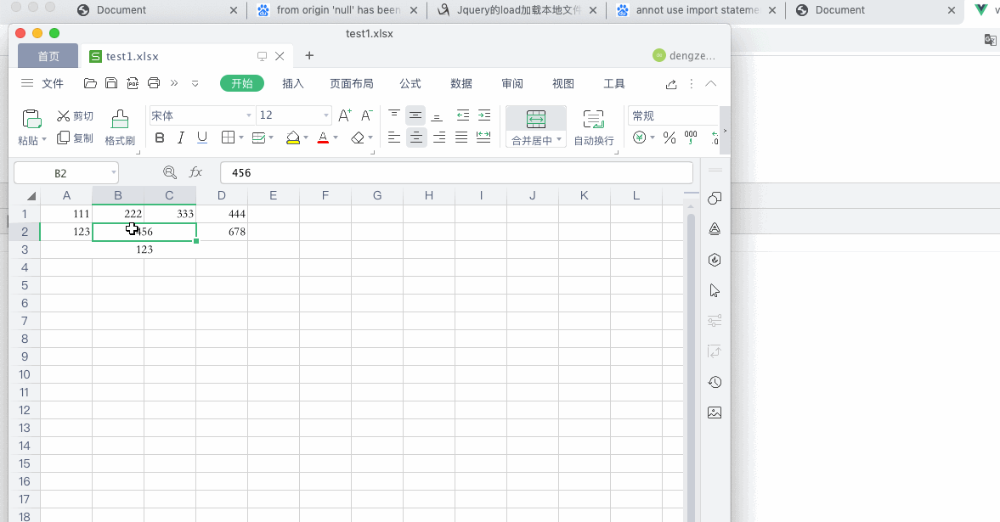

# FormJson
csv、xls、xlsx、文件通过 JavaScript 解析成为 JSON 数据，支持行列合并问题，CSV文件逗号分隔问题。

注意该项目用于 vue，js文件里面使用到了 import export 等关键字，如果需要用于原生 HTML 项目，那么需要去掉这些关键字的支持。



``` Vue
<template>
  <input type="file" @change="read">
</template>
<script>
import { formJson } from './form-json/form'
export default {
  methods: {
    read (e) {
      const file = e.target.files[0]
      formJson(file, (code, data) => {
        console.log(code, data)
      })
    }
  }
}
</script>
```

``` HTML 但是目前DEMO是不能直接使用的，需要去掉关键字的支持
<body>
  <!-- 上传组件 -->
  <input type="file" onchange="read(this)">
  <script src="./form-json/form.js"></script>
  <script>
    // 注意该项目用于 vue，js文件里面使用到了 import export 等关键字，如果需要用于原生 HTML 项目，那么需要去掉这些关键字的支持。
    // 这里只是举个例子是这样使用的
    // 解析文件
    function read (e) {
      // 获取到上传的文件 File 对象
      const file = e.files
      // 传入上传的文件 File 对象，等待解析，code 码解释在 form.js 文件里面
      formJson(file, (code, data) => {
        console.log(code, data)
      })
    }
  </script>
</body>
```
